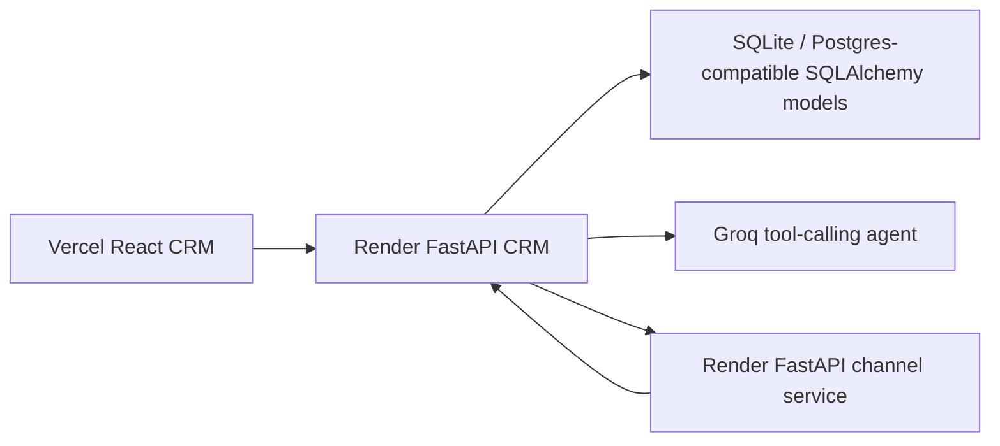

# ThreadSignal

AI-native mini CRM for a D2C fashion brand. Marketers describe a campaign goal in plain English, and the agent segments shoppers, drafts personalized WhatsApp copy, sends the campaign through a stubbed channel service, and surfaces delivery/engagement performance.

## Product Point Of View

ThreadSignal is intentionally chat-first. Instead of asking a marketer to manually build filters, write copy, and trigger sends across separate screens, the product treats campaign creation as an agentic workflow:

1. Understand the marketer's intent.
2. Segment shoppers from customer and order data.
3. Draft personalized messages.
4. Dispatch through a separate channel service.
5. Track receipts and summarize campaign performance.

The dashboard and customer table exist to make the agent's actions inspectable, not to become a generic sales CRM.

## Architecture



The CRM backend owns customers, orders, campaigns, and campaign logs. The channel service is deliberately separate and simulates the messaging lifecycle. When the CRM sends a campaign, the channel service asynchronously calls the CRM receipt API with `sent`, `delivered`, `failed`, `opened`, and `clicked` events.

## Tech Stack

- Frontend: React, Vite, Recharts, Axios, Lucide icons
- CRM backend: FastAPI, SQLAlchemy, Pydantic, Groq API
- Channel service: FastAPI, HTTPX async callbacks
- Data: seeded fashion shopper dataset for demo realism

## Local Development

Backend:

```bash
cd backend
pip install -r requirements.txt
uvicorn main:app --reload --port 8000
```

Channel service:

```bash
cd channel-service
pip install -r requirements.txt
uvicorn main:app --reload --port 8001
```

Frontend:

```bash
cd frontend
npm install
npm run dev
```

Important environment variables:

- `GROQ_API_KEY`: required for the AI campaign agent
- `DATABASE_URL`: optional, defaults to local SQLite
- `CHANNEL_SERVICE_URL`: CRM backend to channel service URL, defaults to `http://localhost:8001`
- `CRM_RECEIPT_URL`: channel service to CRM backend URL, defaults to `http://localhost:8000`

## Assignment Tradeoffs

What I optimized for:

- A clear AI-native campaign workflow over a large number of shallow CRM screens.
- A realistic two-service delivery loop instead of integrating a real WhatsApp/SMS provider.
- Inspectability: campaign logs and dashboard stats make the agent's work visible.

What I consciously did not build for this take-home scope:

- Authentication and tenant isolation.
- A production message queue. At scale, the channel service callbacks should move through a queue such as Redis/Celery, SQS, or Kafka with retries and idempotency keys.
- Advanced attribution such as "order came from this communication." The schema leaves room for it, but the demo focuses on delivery and engagement events.
- A full visual segment builder. The product bet is that the AI agent is the primary campaign creation interface.

## Scale Notes

For the assignment demo, synchronous API calls and SQLite are enough. For production scale, I would move campaign execution to background jobs, persist channel provider request IDs, make receipt callbacks idempotent, add retry/backoff policies, and pre-aggregate campaign stats instead of recomputing from logs on every dashboard request.
